# EAI Platform - UI/UX Specification

**Versao:** 1.0
**Data:** 2025-12-27
**Status:** Draft
**Autor:** UX Expert Sally (BMAD-Method)

---

## 1. Introduction

Este documento define os objetivos de experiencia do usuario, arquitetura de informacao, fluxos de usuario e especificacoes de design visual para a interface da plataforma EAI. Serve como fundacao para o design visual e desenvolvimento frontend, garantindo uma experiencia coesa e centrada no usuario.

### 1.1 Overall UX Goals & Principles

#### Target User Personas

**Persona 1: Jogador Casual (Lucas, 16 anos)**
- Estudante do ensino medio
- Joga no celular entre aulas e no PC em casa
- Quer diversao rapida sem complicacao
- Nao quer criar conta, so jogar
- Gosta de jogos de acao e puzzle
- *"Quero abrir e jogar em segundos"*

**Persona 2: Estudante Kids (Sofia, 9 anos)**
- Aluna do 4o ano
- Usa tablet dos pais
- Gosta de jogos coloridos e recompensas
- Precisa de interface simples e intuitiva
- Pais supervisionam o uso
- *"Quero aprender brincando!"*

**Persona 3: Pai/Professor (Carlos, 38 anos)** *(Fase 2)*
- Pai de Sofia, professor de matematica
- Busca conteudo seguro e educativo
- Quer saber o que os filhos/alunos estao jogando
- Valoriza relatorios de progresso
- *"Preciso confiar que o conteudo e apropriado"*

#### Usability Goals

| Goal | Metrica | Target |
|------|---------|--------|
| **Facilidade de aprendizado** | Tempo para jogar primeiro jogo | < 30 segundos |
| **Eficiencia** | Cliques para iniciar um jogo | <= 3 cliques |
| **Descoberta** | Jogos visualizados por sessao | >= 5 jogos |
| **Retencao** | Tempo medio de sessao | >= 15 minutos |
| **Satisfacao** | NPS | >= 40 |

#### Design Principles

1. **Zero Fricção** - Nenhuma barreira entre o usuario e o jogo. Sem popups, sem cadastro obrigatorio, sem interrupcoes.

2. **Diversao Primeiro** - O visual deve transmitir energia e diversao. Cores vibrantes, animacoes suaves, feedback positivo.

3. **Simplicidade Inteligente** - Interface limpa que esconde complexidade. Filtros poderosos, mas discretos.

4. **Confianca para Pais** - Visual profissional que transmite seguranca. Area educacional claramente identificavel.

5. **Mobile-First** - Projetado para funcionar perfeitamente em qualquer dispositivo, especialmente mobile.

### 1.2 Change Log

| Data | Versao | Descricao | Autor |
|------|--------|-----------|-------|
| 2025-12-27 | 1.0 | Criacao inicial | UX Expert Sally |

---

## 2. Information Architecture (IA)

### 2.1 Site Map / Screen Inventory

```mermaid
graph TD
    HOME[🏠 Homepage]

    HOME --> ARCADE[🎮 Arcade]
    HOME --> EDU[📚 Educacional]
    HOME --> PROF[💼 Profissional<br/>Em Breve]
    HOME --> STUDIO[🛠️ Estúdio<br/>Em Breve]

    ARCADE --> ARC_CAT[Catálogo Arcade]
    ARC_CAT --> ARC_GAME[Página do Jogo]

    EDU --> EDU_CAT[Catálogo Educacional]
    EDU_CAT --> EDU_GAME[Página do Jogo Educativo]

    HOME --> SEARCH[🔍 Busca]
    SEARCH --> RESULTS[Resultados]

    HOME --> ABOUT[ℹ️ Sobre]
    HOME --> TERMS[📄 Termos]
    HOME --> PRIVACY[🔒 Privacidade]

    PROF --> NOTIFY[📧 Notifique-me]
    STUDIO --> NOTIFY
```



### 2.2 Navigation Structure

**Primary Navigation (Header)**
```
[Logo EAI] [Arcade] [Educacional] [Profissional*] [Estúdio*] [🔍 Busca]

* Marcados como "Em Breve"
```

**Secondary Navigation (Footer)**
```
Sobre | Termos de Uso | Privacidade | Contato
```

**Breadcrumb Strategy**
```
Homepage > Arcade > Puzzle > Nome do Jogo
Homepage > Educacional > Matemática > Nome do Jogo
```

---

## 3. User Flows

### 3.1 Flow: Jogar um Jogo (Arcade)

**User Goal:** Encontrar e jogar um jogo casual rapidamente

**Entry Points:**
- Homepage (jogos em destaque)
- Catalogo Arcade
- Resultados de busca

**Success Criteria:**
- Usuario inicia jogo em <= 3 cliques
- Jogo carrega em < 5 segundos


**Edge Cases & Error Handling:**
- Jogo nao carrega: Exibir mensagem amigavel + sugerir outros jogos
- Conexao lenta: Loading skeleton + barra de progresso
- Iframe bloqueado: Instrucoes para usuario ou link direto

---

### 3.2 Flow: Encontrar Jogo Educacional por Materia

**User Goal:** Pai/professor encontra jogo de matematica para crianca de 9 anos

**Entry Points:**
- Homepage (secao educacional)
- Menu Educacional

**Success Criteria:**
- Encontrar jogo adequado em < 1 minuto
- Filtros claros por materia e idade


**Edge Cases & Error Handling:**
- Nenhum jogo para filtro: Sugerir remover um filtro ou mostrar similares
- Muitos resultados: Ordenar por popularidade/avaliacao

---

### 3.3 Flow: Busca Global

**User Goal:** Encontrar jogo especifico por nome

**Entry Points:**
- Campo de busca no header (todas as paginas)

**Success Criteria:**
- Resultados aparecem enquanto digita (debounce)
- Resultados relevantes em primeiro lugar


---

## 4. Wireframes & Mockups

### 4.1 Design Files

**Primary Design Files:** A ser criado no Figma
**Alternativa:** Usar v0.dev ou Lovable para prototipagem rapida

### 4.2 Key Screen Layouts

#### Homepage

**Purpose:** Primeira impressao, apresentar o ecossistema EAI, destacar jogos

**Key Elements:**
- Header com logo, navegacao e busca
- Hero section com tagline "Jogue. Aprenda. Evolua."
- Secao "Jogos em Destaque" (carrossel/grid)
- Cards das 4 areas (Arcade, Educacional, Profissional*, Estudio*)
- Secao "Novidades" ou "Populares"
- Footer

**Layout Conceitual:**
```
┌─────────────────────────────────────────────────────┐
│ [Logo]  Arcade  Educacional  Prof*  Est*    [🔍]   │
├─────────────────────────────────────────────────────┤
│                                                     │
│         ████████████████████████████                │
│         ██                        ██                │
│         ██   Jogue. Aprenda.      ██                │
│         ██       Evolua.          ██                │
│         ██                        ██                │
│         ██   [Começar a Jogar]    ██                │
│         ████████████████████████████                │
│                                                     │
├─────────────────────────────────────────────────────┤
│  Jogos em Destaque                    [Ver todos]  │
│  ┌────┐ ┌────┐ ┌────┐ ┌────┐ ┌────┐ ┌────┐        │
│  │Game│ │Game│ │Game│ │Game│ │Game│ │Game│        │
│  └────┘ └────┘ └────┘ └────┘ └────┘ └────┘        │
├─────────────────────────────────────────────────────┤
│  ┌──────────┐ ┌──────────┐ ┌──────────┐ ┌────────┐ │
│  │ 🎮       │ │ 📚       │ │ 💼       │ │ 🛠️     │ │
│  │ ARCADE   │ │EDUCACION │ │ PROFISS* │ │ESTÚDIO*│ │
│  │          │ │   AL     │ │          │ │        │ │
│  └──────────┘ └──────────┘ └──────────┘ └────────┘ │
├─────────────────────────────────────────────────────┤
│  Sobre | Termos | Privacidade | Contato            │
└─────────────────────────────────────────────────────┘
```

---

#### Catalogo Arcade

**Purpose:** Navegar e descobrir jogos casuais

**Key Elements:**
- Header consistente
- Breadcrumb (Home > Arcade)
- Sidebar/tabs com categorias
- Grid de jogos (cards)
- Ordenacao (Popular, Novos, A-Z)
- Paginacao ou infinite scroll

**Layout Conceitual:**
```
┌─────────────────────────────────────────────────────┐
│ [Logo]  Arcade  Educacional  Prof*  Est*    [🔍]   │
├─────────────────────────────────────────────────────┤
│ Home > Arcade                                       │
├─────────────────────────────────────────────────────┤
│         Arcade - Jogos Casuais                      │
│                                                     │
│ ┌─────────┐  ┌────┐ ┌────┐ ┌────┐ ┌────┐          │
│ │Categorias│  │Game│ │Game│ │Game│ │Game│          │
│ │         │  │    │ │    │ │    │ │    │          │
│ │ Todos   │  └────┘ └────┘ └────┘ └────┘          │
│ │ Ação    │  ┌────┐ ┌────┐ ┌────┐ ┌────┐          │
│ │ Puzzle  │  │Game│ │Game│ │Game│ │Game│          │
│ │ Aventura│  │    │ │    │ │    │ │    │          │
│ │ Corrida │  └────┘ └────┘ └────┘ └────┘          │
│ │ Esportes│                                        │
│ │ Multi   │        [Carregar mais...]              │
│ └─────────┘                                        │
└─────────────────────────────────────────────────────┘
```

---

#### Catalogo Educacional

**Purpose:** Encontrar jogos educativos por materia/idade

**Key Elements:**
- Filtros por Materia (Matematica, Portugues, Ciencias, Ingles)
- Filtros por Idade (6-8, 9-10, 11-12)
- Chips de filtros ativos
- Cards de jogos com badge educacional
- Objetivo educacional visivel

**Layout Conceitual:**
```
┌─────────────────────────────────────────────────────┐
│ [Logo]  Arcade  Educacional  Prof*  Est*    [🔍]   │
├─────────────────────────────────────────────────────┤
│ Home > Educacional                                  │
├─────────────────────────────────────────────────────┤
│         Educacional - Aprenda Brincando!           │
│                                                     │
│ Matéria: [Todas▼] [Matemática] [Português] [...]   │
│ Idade:   [Todas▼] [6-8] [9-10] [11-12]             │
│                                                     │
│ Filtros ativos: [Matemática ✕] [9-10 anos ✕]       │
│                                                     │
│ ┌────────────┐ ┌────────────┐ ┌────────────┐       │
│ │ 🧮 Matema. │ │ 🧮 Matema. │ │ 🧮 Matema. │       │
│ │ [Imagem]   │ │ [Imagem]   │ │ [Imagem]   │       │
│ │ Jogo XYZ   │ │ Jogo ABC   │ │ Jogo 123   │       │
│ │ Aprenda    │ │ Pratique   │ │ Domine     │       │
│ │ adicao     │ │ subtracao  │ │ tabuada    │       │
│ └────────────┘ └────────────┘ └────────────┘       │
└─────────────────────────────────────────────────────┘
```

---

#### Pagina do Jogo

**Purpose:** Jogar o jogo, ver detalhes, descobrir relacionados

**Key Elements:**
- Player (iframe) em destaque
- Botao fullscreen
- Titulo e descricao
- Tags/categoria
- (Educacional) Objetivo educacional
- Secao "Jogos Relacionados"
- Botao voltar ao catalogo

**Layout Conceitual:**
```
┌─────────────────────────────────────────────────────┐
│ [Logo]  Arcade  Educacional  Prof*  Est*    [🔍]   │
├─────────────────────────────────────────────────────┤
│ Home > Arcade > Puzzle > Nome do Jogo               │
├─────────────────────────────────────────────────────┤
│                                                     │
│  ┌─────────────────────────────────────────────┐   │
│  │                                             │   │
│  │                                             │   │
│  │              GAME PLAYER                    │   │
│  │              (iframe)                       │   │
│  │                                             │   │
│  │                                    [⛶]     │   │
│  └─────────────────────────────────────────────┘   │
│                                                     │
│  Nome do Jogo                         [Puzzle]     │
│  Descricao breve do jogo que explica              │
│  a mecanica e objetivo.                           │
│                                                     │
├─────────────────────────────────────────────────────┤
│  Você também pode gostar:                          │
│  ┌────┐ ┌────┐ ┌────┐ ┌────┐                      │
│  │Game│ │Game│ │Game│ │Game│                      │
│  └────┘ └────┘ └────┘ └────┘                      │
└─────────────────────────────────────────────────────┘
```

---

## 5. Component Library / Design System

### 5.1 Design System Approach

**Abordagem:** Usar **shadcn/ui** como base + customizacao com Tailwind CSS

**Rationale:**
- Componentes acessiveis por padrao
- Totalmente customizaveis (nao e biblioteca, e codigo)
- Integra perfeitamente com Tailwind
- Permite identidade visual propria

### 5.2 Core Components

#### GameCard

**Purpose:** Exibir preview de um jogo no catalogo

**Variants:**
- `default` - Card padrao para Arcade
- `educational` - Card com badge de materia/idade
- `featured` - Card maior para destaques

**States:**
- default, hover (scale up + shadow), loading (skeleton)

**Usage Guidelines:**
- Sempre incluir thumbnail, titulo, categoria
- Educacional: adicionar badge de materia
- Hover: feedback visual imediato

---

#### CategoryFilter

**Purpose:** Filtrar jogos por categoria

**Variants:**
- `tabs` - Para desktop (horizontal)
- `dropdown` - Para mobile

**States:**
- default, active, disabled

**Usage Guidelines:**
- Destacar categoria ativa visualmente
- Mostrar contador de jogos por categoria
- Permitir "Todos" para remover filtro

---

#### SearchBar

**Purpose:** Buscar jogos globalmente

**Variants:**
- `compact` - No header (icone que expande)
- `expanded` - Na pagina de busca

**States:**
- default, focused, loading, with-results, no-results

**Usage Guidelines:**
- Debounce de 300ms
- Minimo 2 caracteres
- Mostrar loading indicator durante busca

---

#### Button

**Purpose:** Acoes primarias e secundarias

**Variants:**
- `primary` - CTA principal (Jogar, Comecar)
- `secondary` - Acoes secundarias
- `ghost` - Acoes terciarias/links
- `icon` - Apenas icone (fullscreen, fechar)

**States:**
- default, hover, active, disabled, loading

---

#### GamePlayer

**Purpose:** Container do iframe do jogo

**Variants:**
- `embedded` - Na pagina
- `fullscreen` - Tela cheia

**States:**
- loading, ready, error, fullscreen

**Usage Guidelines:**
- Aspect ratio 16:9 por padrao
- Botao fullscreen sempre visivel
- Loading skeleton enquanto carrega

---

## 6. Branding & Style Guide

### 6.1 Visual Identity

**Brand Guidelines:** A ser desenvolvido

**Conceito Visual:**
- Moderno e vibrante
- Amigavel para todas as idades
- Profissional o suficiente para pais/escolas
- Energia e diversao

### 6.2 Color Palette

| Color Type | Hex Code | Tailwind | Usage |
|------------|----------|----------|-------|
| Primary | `#6366F1` | indigo-500 | CTAs, links, brand |
| Primary Dark | `#4F46E5` | indigo-600 | Hover states |
| Secondary | `#10B981` | emerald-500 | Sucesso, educacional |
| Accent | `#F59E0B` | amber-500 | Destaques, badges |
| Arcade | `#8B5CF6` | violet-500 | Area Arcade |
| Educational | `#06B6D4` | cyan-500 | Area Educacional |
| Success | `#22C55E` | green-500 | Feedback positivo |
| Warning | `#EAB308` | yellow-500 | Avisos |
| Error | `#EF4444` | red-500 | Erros |
| Background | `#FAFAFA` | neutral-50 | Fundo geral |
| Surface | `#FFFFFF` | white | Cards, modais |
| Text Primary | `#18181B` | zinc-900 | Texto principal |
| Text Secondary | `#71717A` | zinc-500 | Texto secundario |

### 6.3 Typography

#### Font Families
- **Primary:** Inter (sans-serif) - Corpo de texto, UI
- **Display:** Poppins (sans-serif) - Headings, brand
- **Monospace:** JetBrains Mono - Codigo (se necessario)

#### Type Scale

| Element | Size | Weight | Line Height | Usage |
|---------|------|--------|-------------|-------|
| Display | 48px / 3rem | 700 | 1.1 | Hero headlines |
| H1 | 36px / 2.25rem | 700 | 1.2 | Page titles |
| H2 | 28px / 1.75rem | 600 | 1.3 | Section headers |
| H3 | 22px / 1.375rem | 600 | 1.4 | Card titles |
| Body | 16px / 1rem | 400 | 1.6 | Paragraphs |
| Body Small | 14px / 0.875rem | 400 | 1.5 | Secondary text |
| Caption | 12px / 0.75rem | 500 | 1.4 | Labels, badges |

### 6.4 Iconography

**Icon Library:** Lucide React (lucide.dev)

**Usage Guidelines:**
- Tamanho padrao: 20px (w-5 h-5)
- Stroke width: 2px
- Usar cores semanticas (primary para acoes, muted para decorativo)
- Sempre acompanhar de texto em botoes (exceto acoes obvias)

### 6.5 Spacing & Layout

**Grid System:**
- 12 colunas
- Gutter: 16px (mobile), 24px (desktop)
- Max-width container: 1280px

**Spacing Scale (Tailwind):**
```
4px  = 1   (p-1, m-1)
8px  = 2   (p-2, m-2)
12px = 3   (p-3, m-3)
16px = 4   (p-4, m-4)
24px = 6   (p-6, m-6)
32px = 8   (p-8, m-8)
48px = 12  (p-12, m-12)
64px = 16  (p-16, m-16)
```

**Border Radius:**
- Small: 4px (rounded)
- Medium: 8px (rounded-lg) - Botoes, inputs
- Large: 12px (rounded-xl) - Cards
- Full: 9999px (rounded-full) - Badges, avatares

---

## 7. Accessibility Requirements

### 7.1 Compliance Target

**Standard:** WCAG 2.1 Level A (minimo), aspirando AA

### 7.2 Key Requirements

**Visual:**
- Contraste minimo: 4.5:1 para texto, 3:1 para elementos graficos
- Focus indicators: Ring visivel em todos elementos interativos
- Text sizing: Suportar zoom ate 200% sem quebra de layout

**Interaction:**
- Keyboard navigation: Tab order logico, todos elementos acessiveis
- Screen reader: Labels em todos inputs, alt text em imagens
- Touch targets: Minimo 44x44px para botoes/links

**Content:**
- Alt text: Todas imagens decorativas com alt="" , informativas com descricao
- Headings: Hierarquia correta (h1 > h2 > h3), um h1 por pagina
- Form labels: Label explicito para cada input

### 7.3 Testing Strategy

- Lighthouse accessibility audit em cada PR
- Teste manual com VoiceOver/NVDA mensalmente
- Verificacao de contraste com Figma plugin

---

## 8. Responsiveness Strategy

### 8.1 Breakpoints

| Breakpoint | Min Width | Max Width | Target Devices |
|------------|-----------|-----------|----------------|
| Mobile S | 320px | 374px | Smartphones pequenos |
| Mobile M | 375px | 424px | iPhone, Android padrao |
| Mobile L | 425px | 767px | Smartphones grandes |
| Tablet | 768px | 1023px | iPad, tablets |
| Desktop | 1024px | 1279px | Laptops |
| Wide | 1280px | - | Monitores, TVs |

### 8.2 Adaptation Patterns

**Layout Changes:**
- Mobile: Stack vertical, 1 coluna de games
- Tablet: 2 colunas de games, sidebar colapsada
- Desktop: 3-4 colunas de games, sidebar visivel

**Navigation Changes:**
- Mobile: Menu hamburger, busca em tela cheia
- Tablet: Menu horizontal compacto
- Desktop: Menu completo, busca inline

**Content Priority:**
- Mobile: Jogos primeiro, filtros colapsados
- Desktop: Filtros visiveis, mais jogos por linha

**Interaction Changes:**
- Mobile: Touch, swipe em carrosseis
- Desktop: Hover states, tooltips

---

## 9. Animation & Micro-interactions

### 9.1 Motion Principles

1. **Rapido e Responsivo** - Animacoes < 300ms para feedback
2. **Natural** - Easing natural (ease-out para entrada, ease-in para saida)
3. **Proposito** - Toda animacao tem funcao (feedback, guia atencao)
4. **Acessivel** - Respeitar `prefers-reduced-motion`

### 9.2 Key Animations

| Animation | Description | Duration | Easing |
|-----------|-------------|----------|--------|
| **Card Hover** | Scale up 1.02, shadow increase | 150ms | ease-out |
| **Button Press** | Scale down 0.98 | 100ms | ease-in |
| **Page Transition** | Fade in content | 200ms | ease-out |
| **Modal Open** | Fade in + scale from 0.95 | 200ms | ease-out |
| **Loading Spinner** | Rotate 360deg infinite | 1000ms | linear |
| **Skeleton Pulse** | Opacity 0.5 to 1 | 1500ms | ease-in-out |
| **Toast Enter** | Slide in from top | 300ms | ease-out |
| **Filter Toggle** | Height collapse/expand | 200ms | ease-out |

---

## 10. Performance Considerations

### 10.1 Performance Goals

| Metric | Target | Measurement |
|--------|--------|-------------|
| **LCP (Largest Contentful Paint)** | < 2.5s | Core Web Vital |
| **FID (First Input Delay)** | < 100ms | Core Web Vital |
| **CLS (Cumulative Layout Shift)** | < 0.1 | Core Web Vital |
| **TTI (Time to Interactive)** | < 3.5s | Lighthouse |
| **Bundle Size (initial)** | < 200KB | Build analysis |

### 10.2 Design Strategies

**Images:**
- WebP format via Next/Image
- Lazy loading abaixo do fold
- Placeholder blur durante carregamento
- Thumbnails otimizados (300x200px max)

**Fonts:**
- Font-display: swap
- Preload fontes principais
- Subset apenas caracteres latinos

**Components:**
- Lazy load paginas de jogo
- Skeleton loading para grids
- Infinite scroll com virtualizacao (se > 100 items)

**CSS:**
- Tailwind purge em producao
- Critical CSS inline

---

## 11. Next Steps

### 11.1 Immediate Actions

1. Revisar e aprovar este Front-end Spec
2. Criar design tokens no Tailwind config
3. Implementar componentes base (GameCard, Button, etc.)
4. Criar prototipos de alta fidelidade no Figma (ou v0.dev)
5. Validar cores/tipografia com stakeholders
6. Testar responsividade em dispositivos reais

### 11.2 Design Handoff Checklist

- [x] User flows documentados
- [x] Component inventory completo
- [x] Accessibility requirements definidos
- [x] Responsive strategy clara
- [x] Brand guidelines incorporados
- [x] Performance goals estabelecidos
- [ ] Prototipos de alta fidelidade criados
- [ ] Design tokens exportados
- [ ] Assets preparados (icones, imagens)

---

## 12. AI UI Generation Prompts

Para acelerar o desenvolvimento, aqui estao prompts para ferramentas como v0.dev:

### Homepage Hero

```
Create a modern hero section for a gaming platform called "EAI".
Include a gradient background (indigo to violet), the tagline "Jogue. Aprenda. Evolua."
in bold white text, a brief description, and a primary CTA button "Começar a Jogar".
Use Tailwind CSS, make it responsive, and add subtle floating game controller icons
as decorative elements.
```

### Game Card Component

```
Create a game card component with:
- Thumbnail image (16:9 ratio) with lazy loading
- Game title (bold, truncate if long)
- Category badge (small, colored pill)
- Hover effect: slight scale up and shadow
- Optional educational badge for subject/age
Use Tailwind CSS, make it responsive, include skeleton loading state.
```

### Category Filter

```
Create a horizontal scrollable category filter for a game catalog.
Categories: All, Action, Puzzle, Adventure, Racing, Sports, Multiplayer
- Active state with primary color background
- Smooth scroll on mobile
- Icons next to each category name
- Counter showing number of games
Use Tailwind CSS, Lucide icons.
```

---

*Document created using BMAD-METHOD framework*
*Last updated: 2025-12-27*
